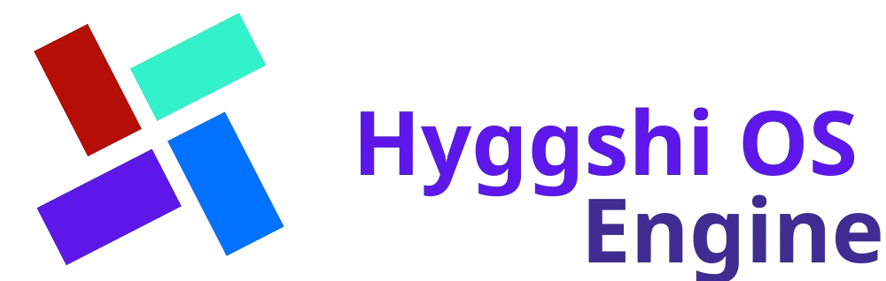

# Hyggshi OS Engine



[](https://github.com/HyggshiOSDeveloper/Hyggshi-OS-Engine/releases)
[](https://github.com/HyggshiOSDeveloper/Hyggshi-OS-Engine/releases)
[](#)
[](LICENSE)
[](https://www.lua.org/)
[](https://luau.org/)

**Hyggshi OS Engine** is a powerful framework built in **Roblox Studio** that lets developers create fully interactive operating system simulations inside Roblox games.
It provides flexible modules, UI tools, and system utilities to make your own in-game OS come alive.

---
## Status
In Progress
This repository contains the actual source code for the Hyggshi OS Engine.
Modules are being developed and documented over time.
This is not reference code or sample code — it is the actual engine framework.

---

## Features

* **Modular system** — plug-and-play components for apps and services
* **Custom UI** — build windows, menus, and taskbars easily
* **Lightweight** — optimized for Roblox performance
* **Extensible** — designed to be embedded into other code modules

---

## Installation

1. Download or clone this repository.
2. Import the **Hyggshi OS Engine** folder into your Roblox Studio project.
3. Place the **ModuleScript** named `HyggshiOSEngine` inside `ReplicatedStorage`.
4. Require it in your main script:

   ```lua
   -- Example usage
   -- Make sure "HyggshiOSEngine" is a ModuleScript inside ReplicatedStorage

   local Engine = require(game.ReplicatedStorage:WaitForChild("HyggshiOSEngine"))
   Engine:Boot("Hyggshi OS")
   ```

---

## Usage

You can build your own apps using LuaU modules and connect them directly to the engine.

```lua
local App = {}
function App:Open()
	print("Launching MyApp inside Hyggshi OS...")
end
return App
```

---

## Purpose

> To be an engine used to embed into code modules and power OS-like experiences in Roblox.

---

## Common Errors

### Error:

```
Attempted to call require with invalid argument(s).
```

**Cause:**
You’re trying to `require` a folder, model, or missing object instead of a ModuleScript.

**Fix:**

* Ensure `HyggshiOSEngine` is a **ModuleScript**, not a folder.
* Check the path:

  ```lua
  print(game.ReplicatedStorage:FindFirstChild("HyggshiOSEngine"))
  ```

  If it prints `nil`, move or rename your module correctly.

---

## Contributing

Contributions are welcome!

* Fork the repository
* Create a feature branch (`git checkout -b feature/new-module`)
* Commit your changes and open a Pull Request

Please keep your code modular and documented for easier maintenance.

---

## License

This project is licensed under the **MIT License**.
You’re free to use, modify, and distribute it—with credit to the original author.
